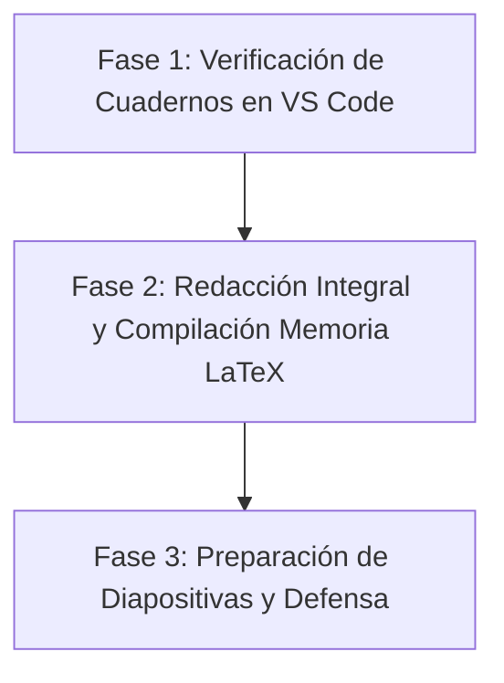

# Plan Maestro Definitivo del TFM: Cierre de Memoria y Defensa

Este documento centraliza la hoja de ruta definitiva del Trabajo de Fin de Máster.
El desarrollo del software, los experimentos y la arquitectura modular (`sarenv-mts`) están **100% COMPLETADOS**.

---

## 1. Estado del Software y Repositorios

El software ha sido refactorizado e integrado profesionalmente, publicado en ambos repositorios:
- **Repositorio Personal:** `https://github.com/jcestefania/TFM.git` (rama `sarenv-mts`).
- **Repositorio Oficial del Laboratorio (Jompy):** `https://github.com/Jompy-GitHub/MTS-UncertainEnvironment.git` (rama `sarenv-mts`).

### Componentes del Framework (`MTS-UncertainEnvironment-Algoritmos-bioinspirados/`)
1. `sarenv/`: Motor bayesiano de probabilidad espacial LPB (Robert Koester).
2. `metrics/`: Módulo de evaluación centralizado (`PathEvaluatorTFM` con 5 métricas SAR estándar).
3. `middleware/`: Conexión de coordenadas UTM, filtros físicos OSM y compilación de escenarios JSON.
4. `busquedas/`: Algoritmos bioinspirados (ACO, ABC, BHA, Voraz Heurístico).
5. `extra/`: Huella del sensor (50 m) y mapa de creencias residual $b(v^k)$.
6. `experiments/`: Scripts de calibración bayesiana (Optuna) y simulación masiva.
7. `TFM_JC/`:
   - `notebooks/`: Los 3 cuadernos oficiales de Jupyter (`Notebook_Demo_Rapida_Interactiva.ipynb`, `Analisis_Resultados.ipynb`, `Benchmark_Perfiles_Real_Interactivo.ipynb`).
   - `resultados/`: Base de datos de 900 simulaciones, CSV maestro y figuras 300 DPI en inglés.

---

## 2. Hoja de Ruta Restante: De la Memoria a la Defensa

---

### ETAPA 1: Verificación Manual de Cuadernos
- [ ] **1. `Notebook_Demo_Rapida_Interactiva.ipynb`:** Ejecución de los 3 pasos (Vista aérea satelital -> Generador Koester con restricciones físicas -> Simulación interactiva con 2 paneles y métricas).
- [ ] **2. `Analisis_Resultados.ipynb`:** Renderizado de tablas maestras y boxplots de las 900 simulaciones.
- [ ] **3. `Benchmark_Perfiles_Real_Interactivo.ipynb`:** Visualización del benchmark por perfiles de búsqueda.

---

### ETAPA 2: Redacción Integral y Compilación de la Memoria LaTeX (`Software/memoria/`)

Asegurar la inclusión exhaustiva de todos los documentos y análisis desarrollados:

- [ ] **Capítulo 1 (Introducción y Motivación):**
  - Justificación del uso de drones en operaciones SAR.
  - Objetivos generales y específicos del TFM.
- [ ] **Capítulo 2 (Estado del Arte):**
  - Fundamentos de búsqueda y salvamento terrestre.
  - Modelos de comportamiento de personas desaparecidas (LPB de Robert Koester).
  - Algoritmos bioinspirados aplicados a robótica aérea (ACO, ABC, BHA).
- [ ] **Capítulo 3 (Modelado del Entorno y del Sensor):**
  - Integración cartográfica de la Casa de Campo (WGS84 -> UTM Zona 30N).
  - Resolución espacial de celda ($10 \times 10$ m).
  - Filtro físico de transitabilidad (lagos y edificaciones fijados a $P=0.0$).
  - Modelo de observación del sensor de Yago Brotón: Huella circular de 50 m ($P_d=1$ en huella, 0 fuera).
  - Estimación de densidad mediante RBF y ajuste Lognormal.
- [ ] **Capítulo 4 (Arquitectura del Framework e Integración):**
  - Arquitectura modular del paquete `sarenv-mts`.
  - Funcionamiento del `middleware` (transformaciones de coordenadas, generación de JSON).
  - Módulo centralizado `metrics` (`PathEvaluatorTFM`).
- [ ] **Capítulo 5 (Marco Experimental y Calibración):**
  - Definición de los 3 perfiles canónicos de Koester:
    - *Autista:* Estructuras 45%, Carreteras 18%, Agua/Bosque/Campo/Matorral 9%. Radios: [0.6, 1.6, 3.7, 15.2] km.
    - *Demencia:* Estructuras 20%, Carreteras 18%, Bosque 17%, Campo 14%, Agua 7%, Matorral 6%. Radios: [0.3, 1.0, 2.4, 12.8] km.
    - *Senderista:* Elementos lineales 25%, Campo 14%, Estructuras 13%, Agua 8%, Bosque 7%, Matorral 3%. Radios: [0.6, 1.8, 3.2, 9.9] km.
  - Calibración Bayesiana de Hiperparámetros con Optuna (30 trials por algoritmo).
  - Definición de las 5 métricas SAR unificadas: Success Rate, Steps to Goal, Cumulative Probability, Covered Area, Total Distance.
- [ ] **Capítulo 6 (Análisis de Resultados y Discusión):**
  - Tablas estadísticas definitivas (900 simulaciones = 6 algoritmos $\times$ 3 perfiles $\times$ 50 semillas).
  - Comparativa de rendimiento: Algoritmos bioinspirados (ACO, ABC, BHA) vs Baselines clásicos (Lawnmower, Expanding Spiral, Voraz).
  - Figuras vectoriales y boxplots de 300 DPI en inglés.
- [ ] **Capítulo 7 (Conclusiones y Trabajo Futuro):**
  - Resumen de aportaciones científicas y técnicas.
  - **Trabajo Futuro 1 (Ruta Real de Bomberos):** Comparación empírica con las trazas GPS de búsqueda terrestre humana del simulacro de la Casa de Campo.
  - **Trabajo Futuro 2 (Víctimas Dinámicas):** Modelado de víctimas en movimiento mediante Cadenas de Markov / Random Walk a partir del Manual de Salvamento Terrestre (`Software/objetivos_dinamicos/`).
- [ ] **Compilación Final:** Generación del PDF de la memoria completo, con bibliografía (.bib) y formato unificado.

---

### ETAPA 3: Preparación de la Presentación y Diapositivas para la Defensa
- [ ] **1. Diapositivas (PowerPoint / Beamer LaTeX):** Presentación ejecutiva de 15 a 20 minutos.
- [ ] **2. Contenido Visual Clave:** Ortografía aérea satelital, mapa de calor con filtro de restricciones, evolución en 4 instantes del mapa de creencias residual $b(v^k)$, tablas de acierto y comparativa de algoritmos.
- [ ] **3. Guion de Defensa:** Preparación de respuestas a posibles preguntas del tribunal (calibración del sensor de 50 m, justificación de perfiles de Koester, escalabilidad del middleware).
