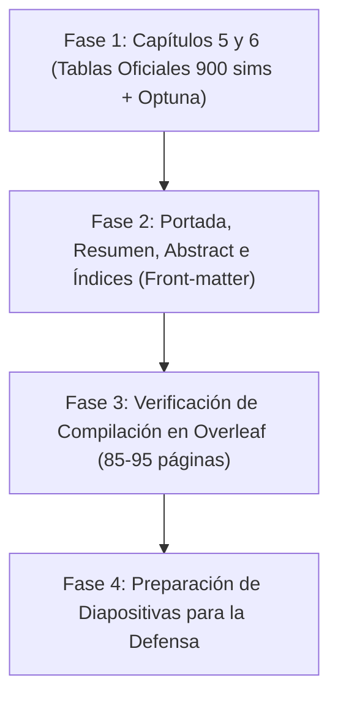

# Plan Maestro Definitivo del TFM: Cierre de Memoria y Defensa

Este documento centraliza la hoja de ruta definitiva del Trabajo de Fin de Máster.
El desarrollo del software, los experimentos y la arquitectura modular (`sarenv-mts`) están **100% COMPLETADOS Y PUBLICADOS EN GITHUB**.

---

## 1. Estado Actual de los Capítulos de la Memoria (`Software/memoria/chapters/`)

| Capítulo | Estado | Acciones Realizadas y Pendientes |
| :--- | :--- | :--- |
| **Capítulo 1 (Introducción)** | 100% Redactado | Contexto de UAVs en SAR y objetivos del TFM. |
| **Capítulo 2 (Estado del Arte)** | 100% Redactado | Fundamentos bayesianos, manual LPB de Koester y bioinspirados. |
| **Capítulo 3 (Modelado y Sensor)** | **100% CERRADO** | Sensor de 50 m de Yago, celda de 10 m, filtro $P=0.0$, justificación del perfil Autista (búsqueda coordinada) y croquis de Montecarlo (despegue fijo). |
| **Capítulo 4 (Desarrollo Framework)** | **100% CERRADO** | Arquitectura modular desglosada en 5 submódulos con diagramas TikZ, middleware UTM a rejilla local, `PathEvaluatorTFM` y herramientas interactivas. *(Opcional: Pseudocódigos formales)*. |
| **Capítulo 5 (Marco Experimental)** | **EN PROCESO** | Integrar tabla oficial de perfiles de Koester, espacio de búsqueda de Optuna y formulación matemática de las 5 métricas SAR. |
| **Capítulo 6 (Análisis de Resultados)** | **EN PROCESO** | Insertar las 3 tablas completas del benchmark (900 simulaciones = 50 semillas x 6 algoritmos x 3 perfiles), boxplots oficiales y discusión de convergencia. |
| **Capítulo 7 (Conclusiones y Futuro)** | **100% CERRADO** | Conclusiones, 2 limitaciones explícitas y 3 líneas cualitativas de trabajo futuro (Bomberos, objetivos dinámicos conceptuales y campos potenciales). |

---

## 2. Hoja de Ruta de Trabajo para las Próximas Sesiones

---

### TAREAS DETALLADAS:

#### FASE 1: Remate de los Capítulos 5 y 6
- [ ] **Capítulo 5 (`5-ProcesoDeExperimentacion.tex`):**
  - Tabla canónica de ponderación de capas y radios cuartiles para Autista, Demencia y Senderista.
  - Tabla del espacio de búsqueda y calibración de hiperparámetros con **Optuna** (30 ensayos por algoritmo).
  - Protocolo experimental de 900 simulaciones de Montecarlo (50 semillas independientes).
  - Formulación matemática de las 5 métricas SAR estandarizadas.
- [ ] **Capítulo 6 (`6-AnalisisDeResultados.tex`):**
  - Tablas definitivas de rendimiento para los 3 perfiles (media $\pm$ desviación estándar sobre 50 semillas para búsqueda informada y ciega).
  - Inserción y referencia de los boxplots oficiales en alta resolución (300 DPI) en inglés (`comparativa_acierto_perfiles.png`, `comparativa_distancia_perfiles.png`, etc.).
  - Discusión profunda sobre el comportamiento de ABC y BHA frente a obstáculos y barrido ciego (Lawnmower).

#### FASE 2: Páginas Preliminares y Formato Oficial UC3M
- [ ] **Portada y Agradecimientos:** Configuración formal de la portada de la Universidad Carlos III de Madrid.
- [ ] **Resumen (Español) y Abstract (Inglés):** Síntesis ejecutiva de la memoria.
- [ ] **Índices Automáticos:** Índice general de contenidos, índice de figuras e índice de tablas.
- [ ] **Glosario de Acrónimos y Símbolos:** Definición de siglas (SAR, UAV, LPB, LKP, IPP, RBF, POD, POA, ACO, ABC, BHA).

#### FASE 3: Compilación y Control de Calidad en Overleaf
- [ ] Subida de archivos `.tex`, `.bib` y la carpeta `imagenes/` a Overleaf.
- [ ] Verificación de 0 errores de compilación y control de volumen final (85–95 páginas).

#### FASE 4: Preparación de Diapositivas y Defensa
- [ ] Presentación ejecutiva de 15–20 minutos.
- [ ] Selección de figuras de alto impacto (ortofotografía satelital, mapa con filtro de restricciones, evolución temporal $b(v^k)$ y boxplots).
- [ ] Guion de defensa y preparación de posibles preguntas del tribunal.
