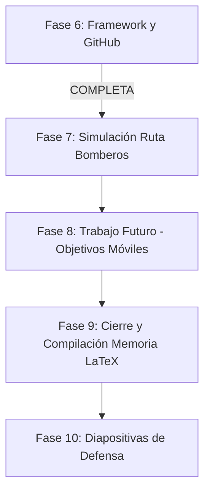

# Plan Maestro Definitivo del TFM: Optimización SAR con Drones (SAREnv + MTS)

Este documento centraliza el estado actual consolidado del proyecto tras la reestructuración profesional y detalla la hoja de ruta exacta para el cierre de la Memoria y la Defensa del TFM.

---

## 1. Estado Actual Consolidado del Software

El framework unificado **`sarenv-mts`** está 100% operativo, probado y publicado en los dos repositorios de GitHub:
- **Repositorio Personal:** `https://github.com/jcestefania/TFM.git` (rama `sarenv-mts` y `main`).
- **Repositorio Oficial del Laboratorio (Jompy):** `https://github.com/Jompy-GitHub/MTS-UncertainEnvironment.git` (rama `sarenv-mts`).

### Estructura Limpia del Proyecto (`framwork-MTS/MTS-UncertainEnvironment-Algoritmos-bioinspirados/`)
- `sarenv/`: Paquete integrado de SAREnv (distribuciones de probabilidad bayesiana LPB de Robert Koester).
- `metrics/`: Módulo de evaluación centralizado (`PathEvaluatorTFM` con las 5 métricas SAR estándar).
- `middleware/`: Herramientas de conversión (`utils_pipeline.py` y `generar_json_real.py`).
- `busquedas/`: Algoritmos bioinspirados (ACO, ABC, BHA y Voraz).
- `extra/`: Renderizado visual y cálculo del mapa de creencias residual $b(v^k)$ con sensor de 50 m.
- `experiments/`: Scripts para ejecuciones masivas y optimización bayesiana con Optuna.
- `TFM_JC/`:
  - `notebooks/`:
    - `Notebook_Demo_Rapida_Interactiva.ipynb`: Cuaderno estrella de demostración interactiva en vivo.
    - `Analisis_Resultados.ipynb`: Cuaderno oficial de análisis estadístico y tablas de la memoria.
    - `Benchmark_Perfiles_Real_Interactivo.ipynb`: Cuaderno del benchmark exhaustivo por perfiles.
  - `resultados/`: Base de datos oficial de las 900 simulaciones, CSVs maestros y figuras en inglés (300 DPI).

---

## 2. Hoja de Ruta Final para Cerrar el TFM

---

### FASE 7: Simulación de la Trayectoria Real de Bomberos
- [ ] **1. Carga de la Ruta GPS de Bomberos:** Importar las coordenadas de la ruta real seguida por el equipo de rescate en el simulacro de la Casa de Campo.
- [ ] **2. Evaluación Probabilística con `PathEvaluatorTFM`:** Evaluar la trayectoria real de los bomberos sobre los 3 mapas canónicos de víctimas (Autista, Demencia y Senderista).
- [ ] **3. Comparativa en la Tabla de Resultados:** Incorporar la fila *"Human Rescuers (Firefighters Baseline)"* en el análisis comparativo del Capítulo 6 para contrastar cuantitativamente la búsqueda humana frente a los drones bioinspirados.

---

### FASE 8: Redacción del Trabajo Futuro (Objetivos Móviles)
- [ ] **1. Fundamentación Teórica del Manual:** Extraer del PDF `Manual-de-Búsqueda-y-Salvamento-Terrestre...` (carpeta `Software/objetivos_dinamicos/`) los modelos de desplazamiento dinámico de víctimas perdidas.
- [ ] **2. Modelo de Cadenas de Markov / Random Walk:** Documentar en el apartado de Trabajo Futuro del Capítulo de Conclusiones la extensión matemática para matrices de probabilidad dinámicas $P(x, y, t)$.

---

### FASE 9: Cierre y Compilación Final de la Memoria LaTeX
- [ ] **1. Capítulo 1 (Introducción):** Revisión final de objetivos e hipótesis.
- [ ] **2. Capítulo 2 (Estado del Arte):** Fundamentos de SAR, drones y optimización heurística.
- [ ] **3. Capítulo 3 (Modelado del Entorno y Sensor):** Documentar la resolución de celda (10 m), huella del sensor de 50 m y filtro físico de lagos/estructuras.
- [ ] **4. Capítulo 4 (Arquitectura e Integración):** Diagrama de bloques de la arquitectura `sarenv-mts` y middleware UTM.
- [ ] **5. Capítulo 5 (Marco Experimental):** Justificación de los perfiles de Koester (Autista, Demencia, Senderista), configuración de Optuna y métricas.
- [ ] **6. Capítulo 6 (Resultados y Discusión):** Inserción de las tablas definitivas de 900 simulaciones, figuras en inglés y análisis comparativo con la ruta de bomberos.
- [ ] **7. Capítulo 7 (Conclusiones y Trabajo Futuro):** Conclusiones del proyecto y modelo markoviano de objetivos móviles.
- [ ] **8. Compilación PDF Final:** Verificación de formato, referencias bibliográficas (.bib) y generación del PDF final sin advertencias.

---

### FASE 10: Presentación y Diapositivas para la Defensa
- [ ] **1. Guion de Defensa (15-20 min):** Estructura orientada al tribunal destacando la aportación científica del middleware y la superioridad de los algoritmos bioinspirados.
- [ ] **2. Selección de Figuras de Alto Impacto:** Mapa satelital con anotaciones, mapa de evolución de creencias $b(v^k)$ en 4 instantes y boxplots comparativos.
