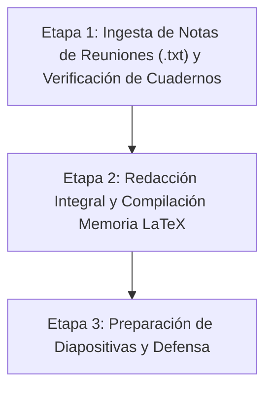

# Plan Maestro Definitivo del TFM: Cierre de Memoria y Defensa

Este documento centraliza la hoja de ruta definitiva del Trabajo de Fin de Máster.
El desarrollo del software, los experimentos y la arquitectura modular (`sarenv-mts`) están **100% COMPLETADOS Y PUBLICADOS EN GITHUB**.

---

## 1. Estado del Software y Repositorios

El software ha sido refactorizado e integrado profesionalmente, publicado en ambos repositorios:
- **Repositorio Personal:** `https://github.com/jcestefania/TFM.git` (rama `sarenv-mts`).
- **Repositorio Oficial del Laboratorio (Jompy):** `https://github.com/Jompy-GitHub/MTS-UncertainEnvironment.git` (rama `sarenv-mts`).

### Componentes del Framework (`MTS-UncertainEnvironment-Algoritmos-bioinspirados/`)
1. `sarenv/`: Motor bayesiano de probabilidad espacial LPB (Robert Koester).
2. `metrics/`: Módulo de evaluación centralizado (`PathEvaluatorTFM` con 5 métricas SAR estándar).
3. `middleware/`: Conexión de coordenadas UTM, filtros físicos OSM y compilación de escenarios JSON.
4. `busquedas/`: Algoritmos bioinspirados (ACO, ABC, BHA, Voraz Heurístico).
5. `extra/`: Huella del sensor (50 m) y mapa de creencias residual $b(v^k)$.
6. `experiments/`: Scripts de calibración bayesiana (Optuna) y simulación masiva.
7. `TFM_JC/`:
   - `notebooks/`: Los 3 cuadernos oficiales de Jupyter (`Notebook_Demo_Rapida_Interactiva.ipynb`, `Analisis_Resultados.ipynb`, `Benchmark_Perfiles_Real_Interactivo.ipynb`).
   - `resultados/`: Base de datos de 900 simulaciones, CSV maestro y figuras 300 DPI en inglés.

---

## 2. Hoja de Ruta Restante: De la Memoria a la Defensa

---

### ETAPA 1: Ingesta de Notas de Reuniones y Verificación de Cuadernos
- [ ] **1. Ingesta de Archivos de Notas (.txt):** Pasar/revisar todos los archivos de texto y notas que tomaste en las reuniones con Jompy para extraer requisitos específicos, correcciones y comentarios clave.
- [ ] **2. Verificación de los 3 Cuadernos en VS Code:**
  - `Notebook_Demo_Rapida_Interactiva.ipynb`: Vista satelital, generador Koester con restricciones y simulación interactiva.
  - `Analisis_Resultados.ipynb`: Tablas estadísticas y boxplots.
  - `Benchmark_Perfiles_Real_Interactivo.ipynb`: Benchmark por perfiles.

---

### ETAPA 2: Redacción Integral y Compilación de la Memoria LaTeX (`Software/memoria/`)

Revisión exhaustiva capítulo por capítulo, contrastando con el índice oficial (`indice_tfm_detallado.md`), el modelo del sensor (`modelo_observacion_sensor_yago.md`), el glosario (`GLOSARIO.md`) y las notas de las reuniones:

- [ ] **Capítulo 1 (Introducción y Motivación):**
  - Justificación del uso de drones en operaciones SAR.
  - Motivación operativa (reducción de tiempos de respuesta en búsqueda de personas).
  - Objetivos generales y específicos del TFM.
  - Estructura del documento.

- [ ] **Capítulo 2 (Estado del Arte):**
  - Fundamentos de búsqueda y salvamento terrestre (SAR).
  - Modelos de comportamiento de personas desaparecidas (Lost Person Behavior de Robert Koester).
  - Algoritmos bioinspirados aplicados a robótica aérea (ACO, ABC, BHA frente a baselines de área).
  - Estado del arte en simuladores SAR (SAREnv) y entornos de incertidumbre (MTS).

- [ ] **Capítulo 3 (Modelado del Entorno y del Sensor):**
  - Georreferenciación en la Casa de Campo de Madrid (WGS84 a UTM Zona 30N).
  - Resolución espacial de celda ($10 \times 10$ m).
  - **Filtro Físico de Transitabilidad:** Masas de agua y edificaciones anuladas a $P=0.0$.
  - **Modelo de Observación del Sensor de Yago Brotón:** Huella circular de 50 m ($P_d=1$ en huella, 0 fuera) en función de FoV de cámara y altitud de vuelo.
  - Estimación de densidad mediante funciones de base radial (RBF) y ajuste Lognormal.
  - Justificación del modelado estocástico de Montecarlo (LKP de despegue fijo vs víctima aleatoria en zonas transitables).

- [ ] **Capítulo 4 (Arquitectura del Framework e Integración):**
  - Arquitectura modular del paquete unificado `sarenv-mts`.
  - Diseño y flujo del `middleware` (transformaciones WGS84/UTM a rejilla discreta, compilación JSON).
  - Módulo centralizado `metrics` (`PathEvaluatorTFM`).
  - Diagrama de flujo completo del pipeline de datos.

- [ ] **Capítulo 5 (Marco Experimental y Calibración):**
  - Configuración canónica de los 3 perfiles de Koester (Autista, Demencia y Senderista) con sus pesos de capas y radios cuartiles.
  - **Calibración Bayesiana de Hiperparámetros con Optuna:** 30 iteraciones por algoritmo ($\alpha, \beta, \rho$ en ACO; límite/scouts en ABC; radio $R$ en BHA).
  - Definición de las 5 métricas SAR unificadas: Success Rate, Steps to Goal, Cumulative Probability, Covered Area, Total Distance.

- [ ] **Capítulo 6 (Análisis de Resultados y Discusión):**
  - Tablas estadísticas definitivas (900 simulaciones = 6 algoritmos $\times$ 3 perfiles $\times$ 50 semillas).
  - Comparativa de rendimiento: Algoritmos bioinspirados (ACO, ABC, BHA) vs Baselines clásicos (Lawnmower, Expanding Spiral, Voraz).
  - Figuras vectoriales y boxplots de 300 DPI en inglés.
  - Discusión profunda sobre convergencia asintótica, mitigación de la miopía y comportamiento frente a barreras geográficas.

- [ ] **Capítulo 7 (Conclusiones y Trabajo Futuro):**
  - Resumen de aportaciones técnicas y científicas.
  - **Trabajo Futuro 1 (Rutas Reales de Bomberos):** Comparación empírica con las trazas GPS de búsqueda terrestre del simulacro de la Casa de Campo.
  - **Trabajo Futuro 2 (Víctimas Dinámicas):** Formulación matemática markoviana para objetivos en movimiento a partir del Manual de Salvamento Terrestre (`Software/objetivos_dinamicos/`).

- [ ] **Compilación y Revisión Final:**
  - Unificación de referencias bibliográficas (.bib).
  - Verificación del formato oficial de la universidad y generación del PDF final sin errores.

---

### ETAPA 3: Preparación de la Presentación y Diapositivas para la Defensa
- [ ] **1. Presentación Ejecutiva (15–20 min):** Diapositivas en PowerPoint / Beamer LaTeX.
- [ ] **2. Selección de Figuras de Alto Impacto:** Ortofografía satelital con anotaciones, mapa de calor con filtro de restricciones, evolución temporal del mapa de creencias $b(v^k)$ en 4 instantes y boxplots comparativos.
- [ ] **3. Guion de Defensa y Posibles Preguntas del Tribunal:** Preparación detallada de respuestas sobre el modelo de sensor (50 m), justificación de perfiles de Koester y escalabilidad del middleware.
