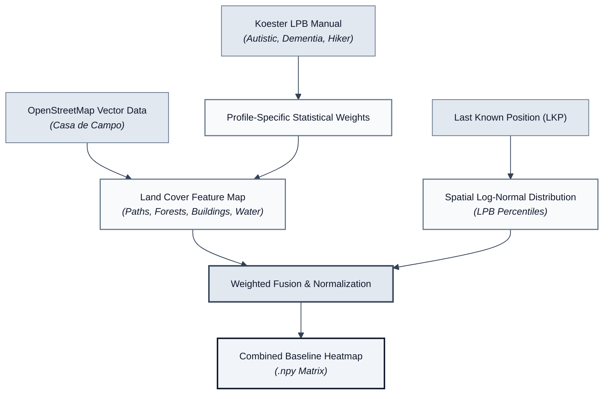
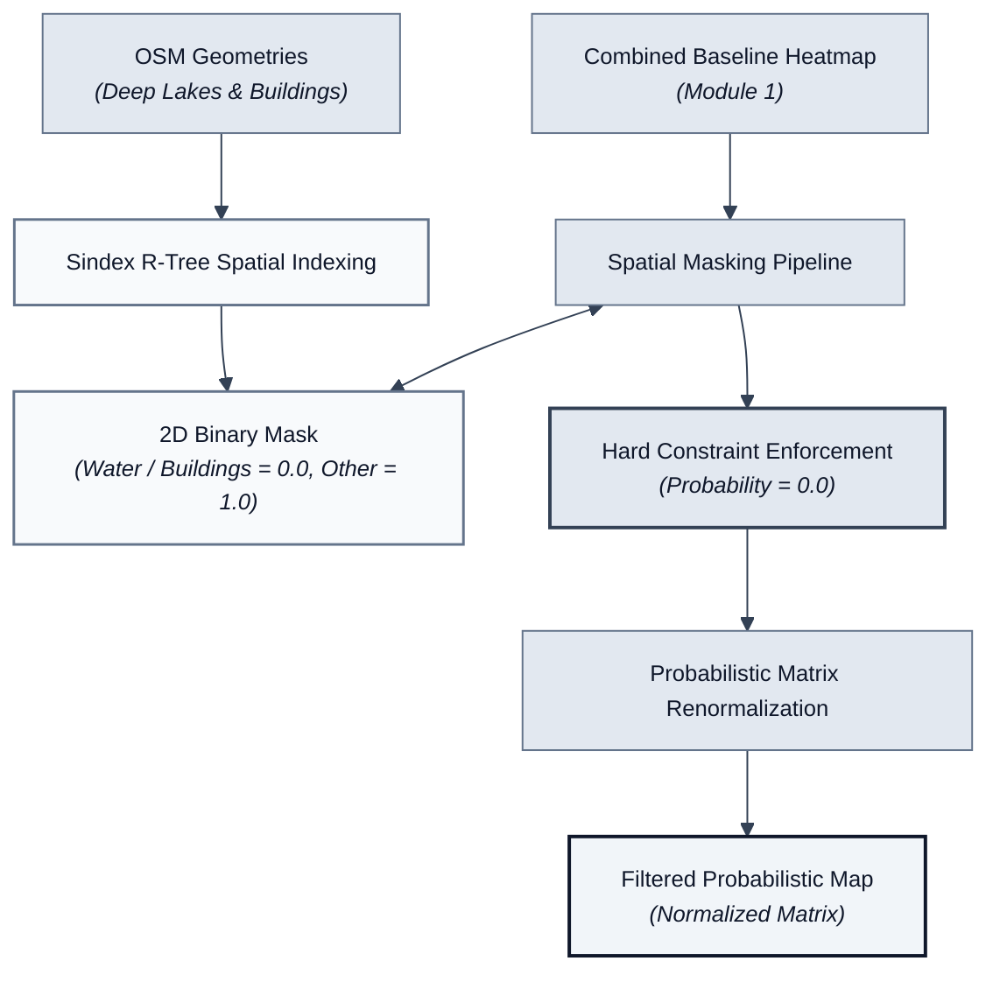
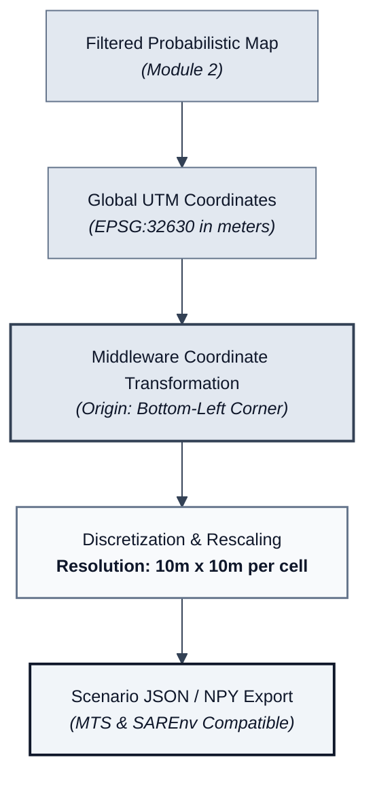
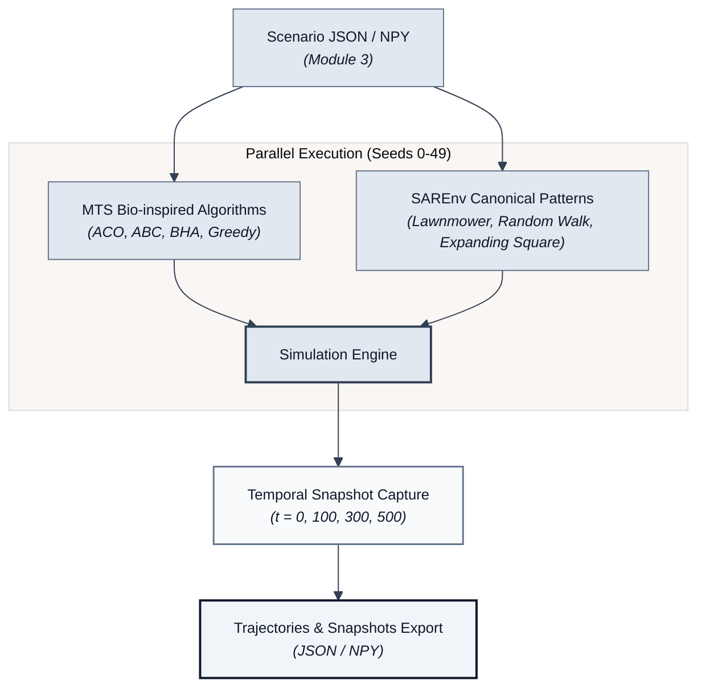
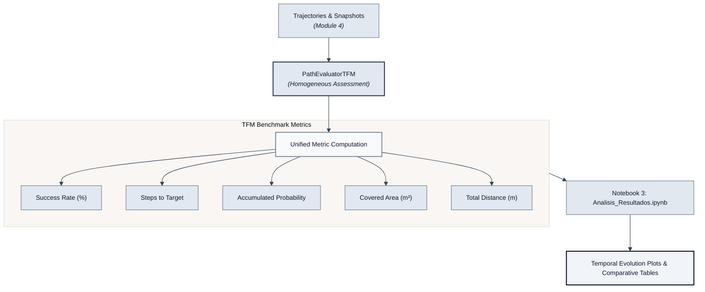

# Arquitectura General y Diagramas Modularizados del Sistema (SAREnv + Middleware + MTS + PathEvaluatorTFM)

Este documento contiene la arquitectura general simplificada (de nivel de sistema) y la descomposición en **diagramas desacoplados por módulo**. La explicación y redacción del documento está en español, mientras que **los diagramas de flujo internos están en inglés** para facilitar su inserción directa en las figuras de la Memoria.

---

## 🏛️ 1. Diagrama General de Arquitectura (Nivel Sistema / Propuesta)

Este diagrama sintetiza el flujo de datos principal entre los 5 módulos funcionales del sistema sin recargar la vista.

---

## 📦 2. Diagramas Desacoplados por Módulo

### 🔹 Módulo 1: Generación de Cartografía y Probabilidad (SAREnv)

Combina la cartografía vectorial real de OpenStreetMap con el modelo estadístico *Lost Person Behavior* (LPB - Robert Koester) y una distribución Log-Normal espacial centrada en la Última Posición Conocida (LKP).

---

### 🔹 Módulo 2: Filtrado de Restricciones Físicas (`Sindex`)

Utiliza indexación espacial mediante $R\text{-Tree}$ (`Sindex`) para proyectar geometrías no transitables (agua profunda y edificaciones urbanas) como restricciones duras con probabilidad $0.0$.

---

### 🔹 Módulo 3: Transformación del Middleware de Coordenadas

Transforma las coordenadas métricas UTM globales ($\text{EPSG:32630}$) en la rejilla local discreta de $10\text{ m} \times 10\text{ m}$ utilizada por el simulador MTS.

---

### 🔹 Módulo 4: Ejecución de Simulaciones y Marcas Temporales

Ejecuta los algoritmos bioinspirados de MTS junto con los patrones canónicos de SAREnv mientras registra marcas de tiempo o hitos temporales ($t = 0, 100, 300, 500$).

---

### 🔹 Módulo 5: Módulo Evaluador Unificado (`PathEvaluatorTFM`)

Calcula de forma homogénea las 5 métricas de rendimiento del benchmark y genera las gráficas de evolución temporal y las tablas comparativas.

