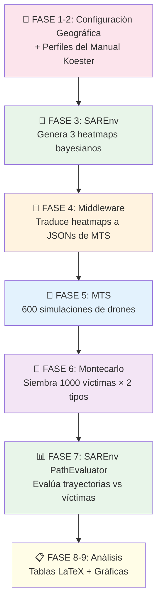
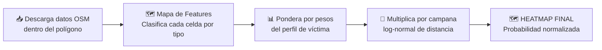
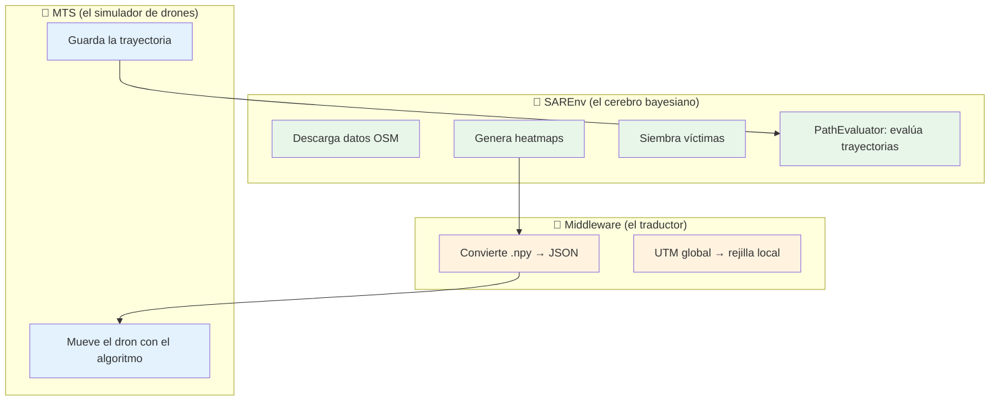

# Guía Completa del TFM: Flujo de Experimentación SAREnv → MTS

> Documento de referencia que explica paso a paso todo el pipeline de experimentación del notebook [Benchmark_Perfiles_Real.ipynb](file:///c:/Users/juanc/Desktop/TFM/TFM-Juan%20Carlos/Software/framwork-MTS/MTS-UncertainEnvironment-Algoritmos-bioinspirados/TFM_JC/pruebas/Benchmark_Perfiles_Real.ipynb), desde la configuración geográfica hasta los resultados finales.

---

## 0. Visión General del Pipeline

Todo el experimento sigue un flujo lineal de **9 fases**. En cada fase interviene un componente distinto:



| Fase | ¿Quién trabaja? | ¿Qué produce? |
|---|---|---|
| 1–2 | Configuración manual | Polígono + pesos + radios por perfil |
| 3 | **SAREnv** | 3 heatmaps `.npy` + 3 `features.geojson` |
| 4 | **Middleware** | 3 archivos `.json` de configuración para MTS |
| 5 | **MTS** | 600 archivos de trayectoria `-traj.json` |
| 6 | **Python (SAREnv)** | 6 archivos `.geojson` de víctimas virtuales |
| 7 | **SAREnv PathEvaluator** | CSV con 5 métricas × 600 corridas |
| 8–9 | **Pandas + Matplotlib** | Tablas LaTeX + Gráficas boxplot |

---

## FASE 1: Configuración Geográfica — El Polígono de la Casa de Campo

### ¿Qué se hace?
Se define el **polígono geográfico exacto** del área de búsqueda: la Casa de Campo de Madrid. Son 5 vértices en coordenadas latitud/longitud (WGS84):

```python
CASA_DE_CAMPO_POLY = shapely.geometry.Polygon([
    [-3.753046, 40.443438],   # Norte
    [-3.771068, 40.438089],   # Noroeste
    [-3.780968, 40.418870],   # Suroeste
    [-3.773619, 40.402040],   # Sur
    [-3.724146, 40.415885],   # Este
    [-3.753046, 40.443438]    # Cierre
])
```

### ¿Por qué un polígono y no un punto + radio?

SAREnv tiene **dos modos** de definir el área de búsqueda:

| Modo | Cuaderno 1.1 (original) | Benchmark (nuestro) |
|---|---|---|
| **Entrada** | Punto central (LKP) + etiqueta `"large"` | Polígono con vértices reales |
| **Función** | `export_dataset(center_point=...)` | `export_dataset_from_polygon(polygon=...)` |
| **Área resultante** | Círculo de radio fijo (ej. 3.2 km) | El polígono exacto que le des |
| **Ventaja** | Rápido, genérico | Representa fielmente el terreno real |

> [!IMPORTANT]
> En nuestro experimento usamos el polígono real porque queríamos que el mapa de calor cubriese **exactamente** los 12.75 km² de la Casa de Campo, no un círculo genérico alrededor de un punto.

Internamente, ambos modos hacen lo mismo: descargan datos de OpenStreetMap dentro del área definida y generan el heatmap. La única diferencia es la **forma del recorte** (círculo vs. polígono).

---

## FASE 2: Perfiles del Manual Koester — Pesos y Radios

### ¿De dónde salen los números?

Del *Manual de Búsqueda y Salvamento Terrestre* (secciones 5.12.6, 5.12.8 y 5.12.11), que recoge estadísticas reales de miles de casos de búsqueda y rescate. Para cada tipo de persona perdida, el manual proporciona **dos tipos de datos**:

### A. Pesos de las capas geográficas (FEATURE_PROBABILITIES)

Indican qué tipo de terreno atrae a cada perfil de víctima. Se expresan como porcentajes que suman ~100%:

| Capa OSM | Autista | Demencia | Senderista |
|---|---|---|---|
| **Estructuras** (edificios, puentes) | **45%** 🔴 | 20% | 13% |
| **Carreteras** | 18% | 18% | 13% |
| **Bosque** (woodland) | 9% | **17%** 🔴 | 7% |
| **Campo** (field) | 9% | 14% | 14% |
| **Elementos lineales** (vallas, vías) | 0% | 9% | **25%** 🔴 |
| **Drenaje** | 0% | 9% | 12% |
| **Agua** | **9%** | 7% | 8% |
| **Matorral** (brush) | 4.5% | 3% | 3% |
| **Maleza** (scrub) | 4.5% | 3% | 2% |
| **Rocas** | 0% | 0% | 4% |

> [!NOTE]
> 🔴 indica el rasgo dominante de cada perfil. El **autista** va hacia estructuras y agua. La persona con **demencia** se pierde en el bosque. El **senderista** sigue caminos lineales.

### B. Radios de dispersión (cuartiles del manual)

Son 4 distancias en kilómetros que responden a la pregunta: *"¿A qué distancia del LKP se encontró a la víctima?"*

| Percentil | Significado | Autista | Demencia | Senderista |
|---|---|---|---|---|
| **25%** (Q1) | 1 de cada 4 se encontró aquí o más cerca | 0.6 km | 0.3 km | 0.6 km |
| **50%** (Q2 / mediana) | La mitad | 1.6 km | 1.0 km | 1.8 km |
| **75%** (Q3) | 3 de cada 4 | 3.7 km | 2.4 km | 3.2 km |
| **95%** (Q4) | Casi todas | 15.2 km | 12.8 km | 9.9 km |

> [!TIP]
> Estos son exactamente los mismos números que SAREnv llama `"small"`, `"medium"`, `"large"` y `"xlarge"` en su código. Es decir: `small = percentil 25%`, `medium = percentil 50%`, `large = percentil 75%`, `xlarge = percentil 95%`. En nuestro benchmark, en lugar de usar esas etiquetas genéricas (que corresponden al senderista por defecto), **inyectamos los radios exactos de cada perfil del manual**.

### ¿Cómo se inyectan en SAREnv?

Modificamos las **variables globales** del módulo `lost_person_behavior.py` antes de generar cada mapa:

```python
import sarenv.utils.lost_person_behavior as lpb

# Antes de generar el heatmap del autista:
lpb.FEATURE_PROBABILITIES = AUTISTA_WEIGHTS   # Cambia los pesos
lpb.RADIUS_FLAT_TEMPERATE = AUTISTA_RADIUS     # Cambia los radios
# Ahora SAREnv usará estos datos para generar el heatmap
```

---

## FASE 3: Generación de los Heatmaps con SAREnv

### ¿Qué hace SAREnv exactamente con esos datos?

SAREnv toma los pesos + radios + polígono y genera un **mapa de calor de probabilidad** (heatmap) mediante un proceso de 4 pasos:



#### Paso 1: Descarga de datos de OpenStreetMap

SAREnv descarga todos los elementos geográficos (edificios, carreteras, ríos, bosques...) que caen dentro del polígono de la Casa de Campo. Los clasifica en las 10 categorías de la tabla de pesos.

#### Paso 2: Mapa de features ponderado

Cada celda de la cuadrícula (de 10×10 metros) recibe un valor basado en qué tipo de terreno hay ahí, multiplicado por el peso del perfil:

$$\text{feature\_map}[i,j] = \sum_{k} w_k \cdot \mathbb{1}[\text{celda}(i,j) \in \text{categoría } k]$$

Donde $w_k$ es el peso del perfil para la categoría $k$ (ej. 0.45 para estructuras en el perfil autista).

#### Paso 3: Campana log-normal de dispersión

Aquí es donde entran **los 4 radios**. SAREnv los usa **todos juntos** para ajustar una **distribución log-normal** (una "campana asimétrica"):

```python
# Los 4 radios son puntos de datos para el ajuste:
percentiles = [0.25, 0.50, 0.75, 0.95]
valores_km  = [0.6,  1.6,  3.7,  15.2]   # Ejemplo: autista

# SAREnv ajusta una log-normal por mínimos cuadrados:
# log(q_i) ≈ μ + σ · z_i
# Obtiene μ (media del log) y σ (desviación del log)
```

Con esos parámetros $\mu$ y $\sigma$, calcula la probabilidad de cada celda según su distancia al centro del polígono:

$$P_{\text{distancia}}(d) = \frac{1}{d \cdot \sigma \sqrt{2\pi}} \exp\left(-\frac{(\ln d - \mu)^2}{2\sigma^2}\right)$$

Donde $d$ es la distancia en km desde la celda al centroide del polígono.

> [!IMPORTANT]
> **No se hace una simulación por cada radio.** Los 4 radios se usan **simultáneamente** para ajustar **UNA sola curva**. Esa curva genera **UN único mapa de distancia** por perfil.

#### Paso 4: Multiplicación bayesiana y normalización

El heatmap final es el **producto** del mapa de features ponderado y el mapa de distancia log-normal, normalizado para que sume 1:

$$P(\text{celda}_{i,j}) = \frac{P_{\text{features}}(i,j) \times P_{\text{distancia}}(i,j)}{\sum_{i,j} P_{\text{features}} \times P_{\text{distancia}}}$$

### ¿Qué archivos produce?

Para **cada perfil** (autista, demencia, senderista), SAREnv genera:

```
TFM_JC/resultados/casa_de_campo_{perfil}/
├── heatmap.npy          ← Matriz NumPy con la probabilidad de cada celda
├── features.geojson     ← Polígonos geográficos (agua, bosque, edificios...)
│                           + metadatos (bounds, center_point, meter_per_bin)
```

### Dimensiones del mapa

Con resolución de **10 m/celda** y la Casa de Campo (~4.6 km × 5.0 km), el heatmap tiene aproximadamente **460 × 500 ≈ 230.000 celdas**.

---

## FASE 4: El Middleware — Traducción de SAREnv a MTS

### ¿Por qué hace falta?

SAREnv y MTS son dos sistemas **completamente independientes** con formatos incompatibles:

| | SAREnv | MTS |
|---|---|---|
| **Coordenadas** | UTM globales (metros reales) | Locales (0,0) en esquina inferior izquierda |
| **Formato** | `.npy` (NumPy) + `.geojson` | `.json` (configuración completa) |
| **Probabilidades** | Continuas [0, 1] | Discretas en rejilla |

### ¿Qué hace el middleware?

El script [generar_json_real.py](file:///c:/Users/juanc/Desktop/TFM/TFM-Juan%20Carlos/Software/framwork-MTS/MTS-UncertainEnvironment-Algoritmos-bioinspirados/TFM_JC/scripts/generar_json_real.py) hace la traducción:

1. **Lee** el `heatmap.npy` y el `features.geojson` de SAREnv
2. **Convierte** las coordenadas UTM a índices de rejilla local $(x, y)$ con origen en $(0, 0)$
3. **Calcula** la posición del LKP (centroide del polígono) en coordenadas locales
4. **Genera** un JSON con el formato que espera MTS, incluyendo:
   - La rejilla de probabilidades
   - Posición inicial del dron (en el LKP)
   - Parámetros del algoritmo y del sensor
   - Número de agentes (1 dron)

### Resultado

```
TFM_JC/resultados/casa_de_campo_{perfil}/
├── escenario_{perfil}.json   ← Archivo de configuración listo para MTS
```

---

## FASE 5: Simulaciones Masivas en MTS

### Configuración del experimento

```python
num_semillas = 50             # Ejecuciones independientes por caso
bateria_pasos = 1000          # Pasos máximos por vuelo
num_drones = 1                # 1 solo dron
algoritmos = ["voraz-heur", "ACO", "ABC", "BHA"]
perfiles = ["autista", "demencia", "senderista"]
```

### ¿Cuántas simulaciones son?

$$3 \text{ perfiles} \times 4 \text{ algoritmos} \times 50 \text{ semillas} = \mathbf{600 \text{ simulaciones}}$$

### ¿Qué cambia con cada semilla?

| Elemento | ¿Cambia con la semilla? | Detalle |
|---|---|---|
| **Heatmap** | ❌ No | Es siempre el mismo para cada perfil |
| **Posición de la víctima** | ✅ Sí | Se muestrea del heatmap con la semilla como RNG |
| **Ruta del dron (bioinspirados)** | ✅ Sí | ACO, ABC, BHA tienen decisiones aleatorias |
| **Ruta del dron (voraz)** | ❌ No | Es determinista: misma trayectoria siempre |

> [!NOTE]
> El algoritmo **voraz-heurístico** no tiene componente aleatorio. La semilla solo afecta al spawn de la víctima, pero como el voraz sigue siempre la misma ruta (va a la celda de mayor probabilidad vecina), sus métricas de trayectoria son **idénticas** para las 50 semillas. Por eso en los boxplots aparece como una línea horizontal.

### ¿Cómo se lanza cada simulación?

El script modifica dinámicamente el JSON de configuración y ejecuta `bf-busqueda.py` (el motor de MTS):

```python
for perfil in perfiles:
    config = cargar_json(f"escenario_{perfil}.json")
    config["dibujar_animacion"] = False   # Sin GUI para ir rápido
    config["num_steps"] = 1000            # Máximo 1000 pasos
    
    for algoritmo in algoritmos:
        for semilla in range(50):
            config["algoritmo_busqueda"] = algoritmo
            config["semilla"] = semilla
            guardar_json(config)
            ejecutar("bf-busqueda.py", config)
```

### ¿Qué produce cada simulación?

Un archivo de trayectoria por ejecución:

```
TFM_JC/resultados/escenario_{perfil}/
├── voraz-heur-0-traj.json     ← Semilla 0
├── voraz-heur-1-traj.json     ← Semilla 1
├── ...
├── bf_aco_ET-0-traj.json
├── bf_abc_ET-0-traj.json
├── bf_bha_ET-0-traj.json
├── ...                        ← 200 archivos por perfil × 3 perfiles = 600
```

Cada `-traj.json` contiene las listas `list_x` y `list_y` con las coordenadas locales (en índices de rejilla) que recorrió el dron.

---

## FASE 6: Siembra de Víctimas Virtuales (Montecarlo)

### ¿Por qué no usar las víctimas de las simulaciones?

En MTS, cada simulación coloca **1 víctima** y ve si el dron la encuentra o no. Eso da un resultado binario (sí/no) que no es muy informativo.

Para evaluar **estadísticamente** cada trayectoria, sembramos **1000 víctimas virtuales** y calculamos cuántas habría detectado el dron en su recorrido. Esto nos da un porcentaje de detección mucho más robusto.

### Dos tipos de siembra

| Tipo | Nombre | Distribución | Propósito |
|---|---|---|---|
| **Informada** | Bayesiana | Muestreada del heatmap | Simula víctimas reales (estadísticamente probables) |
| **Ciega** | Uniforme | Distribuida al azar en el polígono | Línea de base para comparar |

### Restricciones de transitabilidad

Ambos tipos de víctimas pasan por un **filtro físico**: se descartan las posiciones que caigan en:
- 💧 **Agua profunda** (ríos, lagos) → la víctima no puede estar flotando
- 🏢 **Estructuras sólidas** (edificios, muros) → la víctima no puede estar dentro de un muro

Esto se hace con un índice espacial (`sindex`) de GeoPandas que verifica geométricamente cada punto.

### Resultado

```
TFM_JC/resultados/casa_de_campo_{perfil}/
├── victimas_informadas.geojson   ← 1000 puntos muestreados del heatmap
├── victimas_ciegas.geojson       ← 1000 puntos uniformes en el polígono
```

---

## FASE 7: Evaluación de Trayectorias con PathEvaluator

### ¿Qué es PathEvaluator?

Es el módulo evaluador de SAREnv ([metrics.py](file:///c:/Users/juanc/Desktop/TFM/TFM-Juan%20Carlos/Software/SAREnv/sarenv/analytics/metrics.py)) que recibe la trayectoria de un dron y las posiciones de víctimas, y calcula **5 métricas académicas**:

### Las 5 Métricas

| # | Métrica | Fórmula / Descripción | Unidades |
|---|---|---|---|
| 1 | **Tasa de Acierto** | % de víctimas dentro del radio de detección del dron | % |
| 2 | **Distancia de Vuelo** | Longitud total de la trayectoria | km |
| 3 | **Pasos Empleados** | Número de movimientos del dron | pasos |
| 4 | **Área Cubierta** | Superficie barrida por la cámara (sin solapamientos) | km² |
| 5 | **Likelihood Score** | Suma de probabilidades del heatmap de las celdas visitadas | [0, 1] |

### Parámetros del sensor (cámara del dron)

| Parámetro | Valor | Significado |
|---|---|---|
| Altitud $H$ | 50 m | Altura de vuelo |
| FOV | 90° | Campo de visión de la cámara |
| Radio de detección $R$ | $H \cdot \tan(\text{FOV}/2) = 50$ m | Distancia máxima a la que detecta una víctima |

### Proceso de evaluación

Para **cada** una de las 600 trayectorias:

1. **Lee** las coordenadas locales $(x, y)$ del archivo `-traj.json`
2. **Convierte** a coordenadas UTM reales: $x_{\text{UTM}} = \text{minx} + x \cdot 10 + 5$ metros
3. **Construye** la línea de vuelo como un `LineString` de Shapely
4. **Evalúa** contra víctimas informadas → calcula las 5 métricas → `Acierto_Informada`
5. **Evalúa** contra víctimas ciegas → calcula las 5 métricas → `Acierto_Ciega`

### Resultado

```
TFM_JC/resultados/resultados_evaluacion_tfm.csv
```

Con 600 filas (una por simulación) y las columnas:
`Perfil, Algoritmo, Semilla, Pasos, Distancia_km, Area_Covered_km2, Likelihood_Score, Acierto_Informada, Acierto_Ciega`

---

## FASES 8–9: Análisis y Gráficas

### Fase 8: Tablas LaTeX

Agrupa los resultados por `(Perfil, Algoritmo)` y calcula media ± desviación típica para cada métrica. Genera automáticamente el código LaTeX listo para pegar en el Capítulo 5 de la memoria.

### Fase 9: Gráficas Boxplot

Genera **3 gráficas de cajas** (una por perfil) que comparan visualmente la tasa de acierto de la búsqueda informada (verde) vs. ciega (naranja) para los 4 algoritmos.

---

## Resumen: ¿Qué hace cada software?



| Componente | Rol | Archivos que produce |
|---|---|---|
| **SAREnv** | Genera mapas de probabilidad + evalúa resultados | `heatmap.npy`, `features.geojson`, `victimas_*.geojson`, `resultados_evaluacion.csv` |
| **Middleware** | Traduce formatos entre SAREnv y MTS | `escenario_{perfil}.json` |
| **MTS** | Ejecuta las simulaciones de búsqueda con drones | `*-traj.json` (trayectorias) |

---

## Números Clave del Experimento

| Concepto | Valor | Justificación |
|---|---|---|
| **Área de búsqueda** | ~12.75 km² | Polígono real Casa de Campo |
| **Resolución** | 10 m/celda | Compromiso entre detalle y velocidad |
| **Celdas del heatmap** | ~460 × 500 ≈ 230.000 | Determinado por el área y la resolución |
| **Pasos máximos** | 1000 | ~10 km de vuelo (a 10 m/paso) |
| **Semillas** | 50 | Suficiente para estadísticas robustas |
| **Algoritmos** | 4 | voraz, ACO, ABC, BHA |
| **Perfiles** | 3 | autista, demencia, senderista |
| **Total simulaciones** | 600 | 3 × 4 × 50 |
| **Víctimas por set** | 1000 | Informadas + 1000 ciegas = 2000 por perfil |
| **Altitud del dron** | 50 m | Radio de detección = 50 m |
